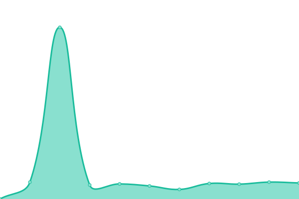

# [📈 Live Status](https://all.webuptime2023.online): <!--live status--> **🟩 All systems operational**

This repository contains the open-source uptime monitor and status page for [Scott Cao](https://all.webuptime2023.online), powered by [Upptime](https://github.com/upptime/upptime).

With [Upptime](https://upptime.js.org), you can get your own unlimited and free uptime monitor and status page, powered entirely by a GitHub repository. We use [Issues](https://github.com/tuyencaovn/recruituptime/issues) as incident reports, [Actions](https://github.com/tuyencaovn/recruituptime/actions) as uptime monitors, and [Pages](https://all.webuptime2023.online) for the status page.

<!--start: status pages-->
<!-- This summary is generated by Upptime (https://github.com/upptime/upptime) -->
<!-- Do not edit this manually, your changes will be overwritten -->
<!-- prettier-ignore -->
| URL | Status | History | Response Time | Uptime |
| --- | ------ | ------- | ------------- | ------ |
|  [Recruit Connect - Website](https://recruitconnect.vn) | 🟩 Up | [recruit-connect-website.yml](https://github.com/tuyencaovn/recruituptime/commits/HEAD/history/recruit-connect-website.yml) | 

 2893ms
     
 | 

<a href="https://all.webuptime2023.online/history/recruit-connect-website">99.53%</a>
    

|  [Recruit Connect - BackOffice](https://admin.recruitconnect.vn) | 🟩 Up | [recruit-connect-back-office.yml](https://github.com/tuyencaovn/recruituptime/commits/HEAD/history/recruit-connect-back-office.yml) | 

 1157ms
     
 | 

<a href="https://all.webuptime2023.online/history/recruit-connect-back-office">98.25%</a>
    

|  [Recruit Connect - API](https://api.recruitconnect.vn) | 🟩 Up | [recruit-connect-api.yml](https://github.com/tuyencaovn/recruituptime/commits/HEAD/history/recruit-connect-api.yml) | 

 1142ms
     
 | 

<a href="https://all.webuptime2023.online/history/recruit-connect-api">98.07%</a>
    

|  [Recruit Connect - ES Status](https://api.recruitconnect.vn/elasticsearch/check-status) | 🟩 Up | [recruit-connect-es-status.yml](https://github.com/tuyencaovn/recruituptime/commits/HEAD/history/recruit-connect-es-status.yml) | 

 264ms
     
 | 

<a href="https://all.webuptime2023.online/history/recruit-connect-es-status">97.69%</a>
    

<!--end: status pages-->

[**Visit our status website →**](https://all.webuptime2023.online)

## 📄 License

- Powered by: [Upptime](https://github.com/upptime/upptime)
- Code: [MIT](./LICENSE) © [Scott Cao](https://all.webuptime2023.online)
- Data in the `./history` directory: [Open Database License](https://opendatacommons.org/licenses/odbl/1-0/)
